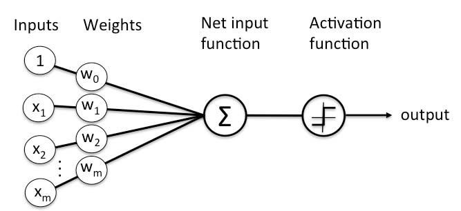
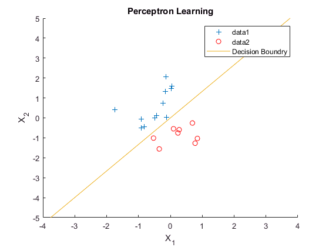
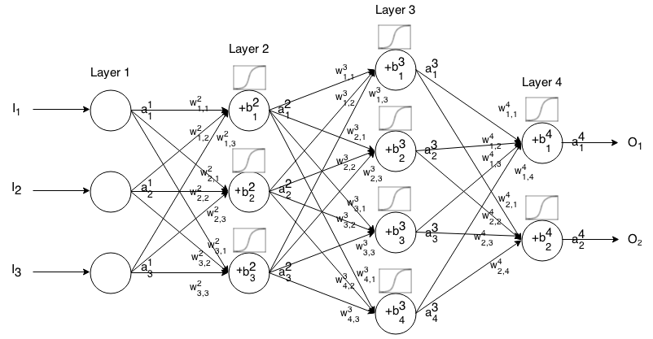
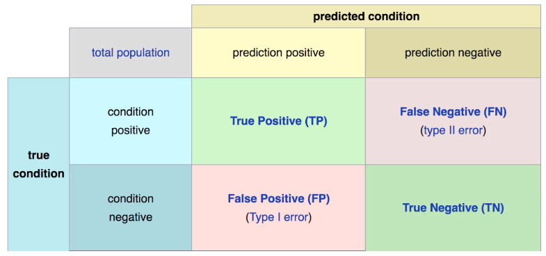

# NEURAL NET BASICS AND GLOSSARY

Neural nets may be used for a wide range of tasks, but two common uses are:	

*  *regression* (predict the value of $y$ given an array of input variables, $X$)
* *classification* (predict the class $y$ given an array of input variables, $X$)

Both of these types of neural networks may be extended to deciding on actions given observations about the state of the world (reinforcement learning).

Neural nets can approximate any function (no matter how complex). This is known as the *universal approximation theorem*.

## Most used neural network packages in Python

* *TensorFlow*: Mostly developed by Google. Has lots of nice 'extras' to make life easier (e.g. automatically stop training when good balance of training vs test accuracy obtained). Is probably the most commonly used package. Uses *Keras* as front-end to make life simpler. But currently 1) Too slow at predictions to use in reinforcement learning, 2) Has a memory leak which becomes apparent in reinforcement learning (memory is slowly gobbled up).

* *PyTorch*: Mostly developed by Facebook. Is very Pythonic in language (very similar to NumPy syntax). Very flexible. More verbose than TensorFlow (uses more lines of code to achieve same task), and does not have as many nice extras.

Probably good to get to know both. But, on the other hand, as the Americans say, "Beware the man with one gun, for he is sure to know how to use it well".

Some say PyTorch is best for *research*, and TensorFlow is best for *production*.

## Common neural network frameworks

Some common neural network frameworks (these may be combined):

* *Feed forward*: Basic network architecture. For relatively simple tasks.

* *Recurrent neural networks* (RNN, LSTM, GRU): Useful when sequence is important (e.g. words, sounds, forecasting).

* *Convolutional neural networks*  (CNNs): Look for common motifs in, e.g. pictures, time-series. Think of as a *sliding window* that scans across a data set. 

* *Embedding*: Encodes/dimensions data so that similar examples are close in 'space' (most commonly used for words, so that words with similar meanings are close together in the embedded vector space). Examples: *word2vec* and *GloVe*.

* *Transformers*: For sequence-to-sequence tasks, such as language translation. These appear to be replacing many RNNs.

* *Encoder/Decoder*: Encode (compress) data in fewer dimension, and decode from that compressed data.

* *Generative Adversarial Networks* (GANs): Two battling networks use to create/detect fake data (images, text, etc).

* *Reinforcement learning* (RL): frameworks that learn how to act given a series of observations. Common frameworks are Deep Q Learning, and Actor-Critic (or developments thereof).

## Single layer perceptron
Below is a simple 'single neurone' perceptron, the simplest 'neural network'.

$output = f(\sum(w_0 + w_1x_1 + w_2x_2 +  \ldots + w_nx_n))$

*Simple step activation function*: Output = 1 if net input function > 0, otherwise 0

*Sigmoid activation function*: Output ranges from 0-1 (0.5 usually taken as a cut-off for classifying as being in the class of interest).

### Use of perceptron
A single neurone perceptron can be used where there is a simple straight-line *decision boundary* between data of different classes.

The decision boundary represents where the output of the activation function switches from one class to the other. With a simple step activation function the output is binary. Other activation functions (e.g. sigmoid or cross-entropy) will give a probability of belonging to one class or another (points further away from the decision boundary will have have greater separation of class probabilities).  

## Simple multi-layer network
Adding layers of neurones allows for complex and non-linear decision boundaries. Each neurone, or *node* in the network behaves like a single neurone perceptron (output is sum of inputs * weights, passed to an activation function).

$a^i_j = \sigma(\sum\limits_k (w^i_{jk} \cdot a^{i-1}_k) + b^i_j)$

$a^i = \sigma(w^i \times a^{i-1} + b^i)$

where:

$\sigma$ is the activation function,

$w^i_{jk}$ is the weight from the $k^{th}$ neuron in the $(i-1)^{th}$ layer to the $j^{th}$ neuron in the $i^{th}$ layer,

$b^i_j$ is the bias of the $j^{th}$ neuron in the $i^{th}$ layer,

$a^i_j$ represents the activation value of the $j^{th}$ neuron in the $i^{th}$ layer.

## Accuracy

### Train/validation/test set split

When assessing the accuracy of a model, the assessment should not be performed using the data used to train the model. The following splits of data are common:

* *Training set*: The $X$ and $y$ data used to train the model.

* *Validation set*: The $X$ and $y$ data used to test the model during model development. As this data set is used to make decisions about the model (e.g. how many layers in the network, how long to train the network for, etc), the accuracy of fitting the validation set may be slightly higher than that achieved when putting the model into production.

* *Test set* (optional): The *test set* (or *holdback* set) is a set of data that is used once, and only once, at the end of the model development to try and assess likely real-world performance. It has not been used at any stage during model development. This test set may be set aside at the start of model building, or it may be composed of new data obtained during/after model development.

Note: with the exception of time-series data, data should be randomised before splitting in training and validation sets.

### k-fold cross-validation

A common method of assessing model accuracy during model development is to use *k-fold cross-validation*. I

When using k-fold validation, data is randomised (apart from time-series data), and split into *k* sets (commonly 5 or 10), such that each case (each individual) is present in one, and only one, test set. The model is then run *k* times, with different test sets each time, as in the figure below.

In classification problems, it is common to use *stratified k-fold cross-validation* where data is split so that each test set is representative of the overall data (e.g. if we are predicting whether the presence of a disease given characteristics of patient symptoms, and if the disease is present in 20% of our complete data set, then each test set should have 20% disease positives).

### Scaling input (X) data
When using neural nets it is most common to scale all input data on scale 0-1. For each feature the data is scaled so that the lowest value is scaled to 0, and the greatest value scaled to 1.

When splitting data in training and test sets, the minimum and maximum is taken from the training data (so test data may be scaled to values outside of 0-1 if there are smaller/larger numbers in the test data compared with the training data).

SciKitLearn has a handy `MinMaxScaler` method for scaling training and test data.

### One-hot encoding

When data is categorical (e.g. 'red', 'green', 'blue'), it is usual to encode the data using *one-hot encoding*. In this case each category becomes a new column of data, one of which (the 'hot' one) will be set to 1 while the others are set to 0. For example:

red,	green,	blue
1,		0,		0
0,		1,		0
0,		0,		1

These new variables may also be called *dummy variables*. SciKitLearn has a method for creating these dummy variables (`sklearn.preprocessing.OneHotEncoder`), and PyTorch has its own method (`torch.nn.functional.one_hot`).

### Classification

Note: Many of the following measures can only be used for binary classification (two class classification). Multi-class classification can be converted to a series of binary classifications (e.g Red, Green, Blue, can also be represented as Red vs non-Red, Green vs. non-Green, Blue vs. non-Blue).

*Accuracy* is the percentage of examples correctly predicted.

*Recall* is the ability to find all the positive cases. Also known as *Sensitivity* or *True Positive Rate*.

	TP / (TP + FN)  True Positives / (True Positives + False Negatives)

*Precision* is the ability to identify only the relevant cases

	TP / (TP + FP)

*F1* is the harmonic mean of precision and recall

	2 * ((p * r) / (p + r))

*Specificity* is the ability to find all the negative cases

TN / (TN + FP)

A confusion matrix shows errors in more detail (confusion matrices may be used for prediction with more than two classes). The number of True Positives, False Positives (Type I error), False negatives (Type II error), and True Negatives, are displayed as a grid.

A *Receiver operating characteristic (ROC) Curve* is one of the most common methods for details assessment of a binary classifier. The probability threshold of classification as a positive case is adjusted, and True Positive Rate  is plotted against False Positive Rate, and the area under the curve calculated.

A summary of the common accuracy measures is shown below (from https://en.wikipedia.org/wiki/Receiver_operating_characteristic).

*Brier score* is mean squared error of actual outcome vs. probability of outcome for each possible outcome.

### Regression

For regression, accuracy is may be measured as:

* Root Mean Square Error (RMSE, or Root Mean Square Deviation)
* Mean Absolute Deviation (mean absolute error)
* $R^2$ (coefficient of determination) of predicted vs. observed, is the proportion of variance of $y$ that is explained by the model. 

## Activation functions

Activation functions transform the output of a neurone.

*Softmax* activation is applied to the final output of a classification neural network, and normalises output to give probabilities for each class (these wil always add up to 1.0).

## Summary of common final activation and loss functions 

  | Problem type                   | Final actv | Loss function             |
  |--------------------------------|------------|---------------------------|
  | Binary classification          | sigmoid    | binary_crossentropy       |
  | Multiclass single label class  | softmax    | categorical_crossentropy  |
  | Multiclass multilabel class    | sigmoid    | binary_crossentropy       |
  | Regression to arbitrary values | None       | mae (Mean Absolute Error) |
  | Regression to values 0-1       | sigmoid    | binary_crossentropy       |

## Tensors

A tensor is an n-dimensional array of data, but frequently refers to arrays with 3+ dimensions. Tensors allow multiple $X$ and $y$ to be batched together in a single data group. These may be processed simultaneously on a GPU. GPUs are frequently more powerful than CPUs, but only for large data groups that can be processed in parallel ('minibatches', and beware using very large batch sizes as this may hamper performance of neural net training; GPUs come into their own when handling image, videos, or sound data).

*'Friends don't let friends use minibatches larger than 32'*, Yann LeCun 2003.

## Common layer types

Some common layer types:

* *Dense* (fully connected): For vectors. Stored in 2D tensors (samples, features). 
* *Recurrent* (e.g. LSTM, GRU layer): For sequences. Stored in 3D vectors (samples, timesteps, features).
* *2D convolutional*: Usually for images. To identify features in a small part of an image. Think of as a *sliding window* that scans across image.
* *1D convolutional*: For text or numerical sequences (look for motifs, e.g. movement that indicates falling over, or patten of hospital admissions that warns of problem).
* *Dropout*: for randomly removing output in layers to reduce over-fitting
* *Pooling*: To consolidate output of 1D or 2D conv layers
* *Batch normalisation*: Used in Recurrent networks mostly. Increases stability.
* *Upscale*: Increase size of tensor by replicating values
* *Conv transpose*: Convolutional to vector

## Partial derivatives, gradients, and backpropagation

*Partial derivative* or *gradient* is a term used to describe how changing a weight in the neural network effects the prediction of the network, at the value of y being predicted. This is the first derivative of $f(x)=y$ for each part of the network. Each neurone has a gradient w.r.t. $x$ and $y$. Note: the gradient changes as $y$ changes.

*Backpropagation* is the method that gradients in a network are calculated. Error is propagated backwards from the end of the network. The backpropogation method opened the door to neural networks becoming the most used type of AI. 

## PyTorch neural net training steps

The following steps are followed in each training step (note, due to use of Tensors, this is done on a minibatches of training examples simultaneously):

* Reset the gradients in the network optimiser
* Predict $\hat{y}$ from features $X$
* Calculate loss
* Proportionate loss through network
* Perform an optimiser step to calculate gradients and update weights 

## A roadmap

General principles:

  * *Vectorize* data
  * *Randomise* (apart from sequential data)
  * *Remove duplicates*, to prevent same sample being in train and test datasets
  * *Standardize* or *normalize* data (0-1, or mean=0, stdev=1)
  * *Handle missing data*. It is common to replace missing data with 0 or -1 (if rest of data on a 0-1 scale). A neural net will learn how to handle it. Can add extra rows of copied data with removed data points (creating fake missing data) to help train the model to handle missing  data well.
  * Use domain knowledge to pre-process data sensibly.

1. Define the problem

    * What are you are trying to predict
    * What data do you need/have
    * What general type of model is needed, e.g.
      - Binary classification
      - Multi-class classification (single label or multiple label)
      - Regression
      - Clustering
      - Generation
      - Reinforcement learning
      - Time series (non-stationary)
      - etc.

2. Choose a measure of success

  Optimization needs a suitable measure of success, e.g.
    * Accuracy/ROC for balanced datasets
    * Precision, recall, F1 for unbalanced data sets
    * Mean average precision for multi-class classification or ranking
    * Custom measures(s)

3. Decide on an evaluation protocol

  Common methods are:
    * Maintain a hold-out validation set
    * K-fold validation
    * Iterative k-fold validation when data is limited

4. Data pre-processing

    * Data cleaning (e.g. imputing missing data)
    * Data will need to be formatted as tensors
    * Scale data (usually -1 to 1 , or 0 to 1)
    * Feature engineering (though less important for Deep Learning)

5. Develop model that is better than baseline/reference

    * Naive model is a frequent baseline choice
    * For Deep Learning model first consider:
      - What is the last layer activation function?
      - What is the loss function?
      - What optimizer will be used?
      - What are the starting model meta-parameters?
      
      
  | Problem type                   | Final actv | Loss function             |
  |--------------------------------|------------|---------------------------|
  | Binary classification          | sigmoid    | binary_crossentropy       |
  | Multiclass single label class  | softmax    | categorical_crossentropy  |
  | Multiclass multilabel class    | sigmoid    | binary_crossentropy       |
  | Regression to arbitrary values | None       | mae (Mean Absolute Error) |
  | Regression to values 0-1       | sigmoid    | binary_crossentropy       |

6. Scaling up - developing a model that over-fits

  Aim initially for a model that over-fits a little. A sign of this is that accuracy on training set increases, while accuracy on test-set starts to worsen. Strategies for over-fitting neural nets include:

    * Add layers
    * Make layers larger
    * Train for more epochs

7. Regularize model and train hyper-parameters
  
  This is often the most time consuming step. Reduce over-fitting by regularisation. Common methods are:

* Reduce training epochs
* Add dropout layers
* Reduce size of network
* Add L1 and/or L2 regularization
* Adjust optimizer hyper-parameters (such as learning rate)
* Reduce features (e.g. PCA).

8. Test final model on hold-out data set

